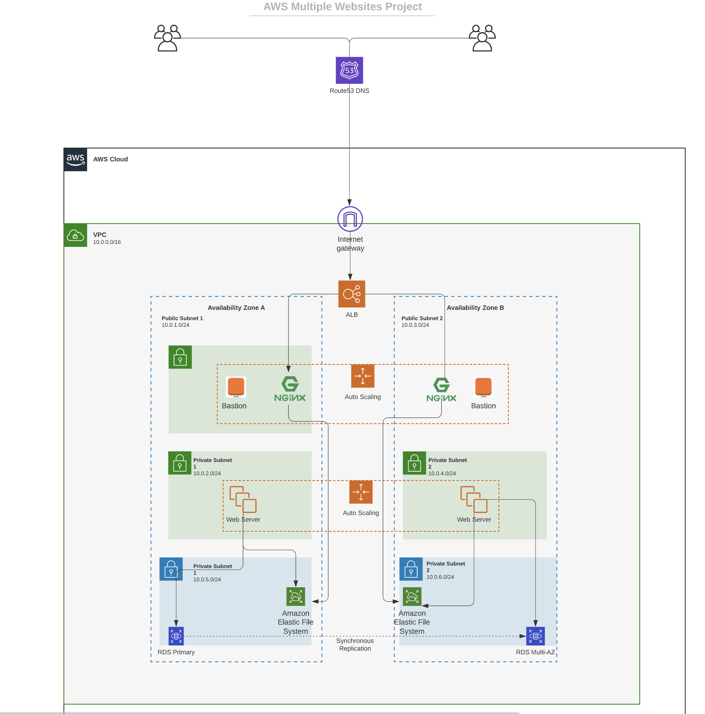
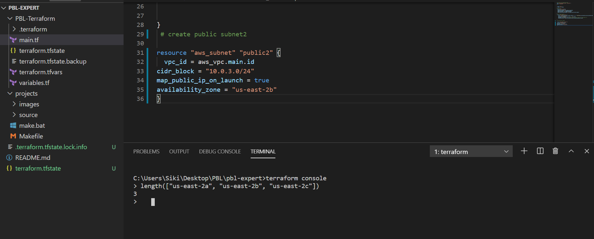
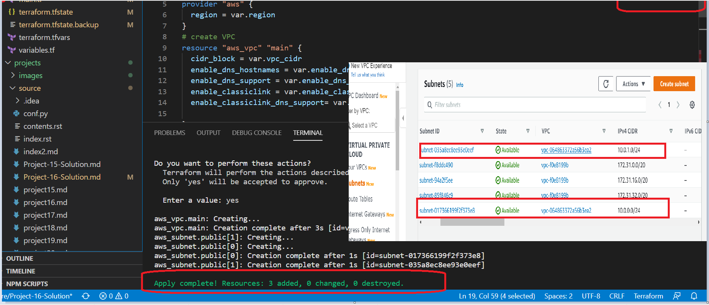

# Automate Infrastructure With IAC using Terraform

Here we can built Infrastructures using Terraform. 



### Lets Get Started

We will begin the project by fulfilling the below pre-requisites

### Before you begin writing Terraform code

* Lets Setup Terraform, Inorder to continue we need preferred text edior such as Visual Studio Code, Atom, or any other editor.
* We need plugins from HashiCorp click [here to download VSC](https://code.visualstudio.com)
* Link for the plugin: [here](https://marketplace.visualstudio.com/items?itemName=HashiCorp.terraform)
* Install Terraform for Linux: [here](https://www.howtoforge.com/how-to-install-terraform-on-ubuntu-1804/)
* Install Terraform for Windows: chocolatey we need Power Shell terminal on Windows

    * `Set-ExecutionPolicy Bypass -Scope Process -Force; [System.Net.ServicePointManager]::SecurityProtocol = [System.Net.ServicePointManager]::SecurityProtocol -bor 3072; iex ((New-Object System.Net.WebClient).DownloadString('https://chocolatey.org/install.ps1))`
   * `choco`>> check chocolately
   * `choco install terraform`
   * `terraform version`>> check version
    
    

* Create an IAM role with administrative permissions. To do this, login to the **DevOps** AWS account and name the role `infra-dev`.
* Create a an IAM user, name it `terraform` (*ensure that the user only has programatic access to the AWS account*) and assign the IAM role created above.
* Copy the secrete access key and access key ID. Save them in a notepad temporarily.
* Configure the terminal on your laptop to connect to AWS using the access keys copied above. If you are on Windows, use `gitbash`, if you are on a Mac, you can simply open up the `terminal`. Read [here](https://docs.aws.amazon.com/sdk-for-java/v1/developer-guide/setup-credentials.html) to configure the terminal properly. 
* For Windows, had to downloadAWS CLI Read [here](https://aws.amazon.com/cli/)
* once completed configure aws uisng `aws configure`on command prompt
* Create an S3 bucket to store Terraform state file. You can name it something like `dev-terraform-bucket` (*Note: S3 buckets are unique within the region, so the name must be completely unique*)


### The secrets to writing quality Terraform code

Every successful terraform project is based on your knowledge of;

- What the end goal is (In AWS)
- The `IAC` technology (In this case Terraform)
- Your access to information (Terraform documentation [Here](https://www.terraform.io/docs/configuration))

As you go along completing this project, you will get familiar with terminologies such as 

- Attributes
- Resources
- Interpolations
- Arguments
- Provider
- Provisioner
- Input & Output Variables
- Modules
- Data Sources
- Locals
- Backend  

#### Best practice

* Ensure that every resource is tagged using multiple key-value pairs. (you will see this in action as we go along)
* As much as possible, ensure that your code is re-usable. Meaning avoid hard-coding values whereever possible. (For learning purpose, we will start by hard coding, but gradually refactor our work to reflect best practices).
  

### The VPC | Subnets | Security Groups

#### Let us create a directory structure.

* Create a folder `PBL`
* Create a file in the folder, name it `main.tf`


#### Provider and VPC resource section

* Add the AWS provider, and a resource to create the VPC in the `main.tf` file.
  * The provider block informs terraform that we intend to build infrastructure against AWS. 
  * The resource block will create a VPC.

```
provider "aws" {
  region = "us-east-2"
}

# Create VPC
  resource "aws_vpc" "main" {
  cidr_block                     = "10.0.0.0/16"
  enable_dns_support             = "true"
  enable_dns_hostnames           = "true"
  enable_classiclink             = "false"
  enable_classiclink_dns_support = "false"
}
```
* The next thing we need to do, is to download the necessary plugins for terraform to work. These plugins are used by `providers` and `provisioners`. At this stage, we only have `provider` in our `main.tf` file. So terraform will just download plugin for the AWS provider.
* Lets accomplish this with `terraform init` command 

***Observations***: 
- Notice that a new directory is being created: `.terraform`. This is where terraform keeps data about plugins. Generally, it is safe to delete this folder. It just means that you must execute `terraform init` again, to download them.

Moving on, let us create the only resource we just defined. `aws_vpc`. But before we do that, we should check to see what terraform intends to create before we tell it to go ahead and create it.
  * Run `terraform plan`
  * Then, If you are happy, execute `terraform apply`


***Observations***: 

1. A new file is created `terraform.tfstate` This is how terraform keeps itself up to date with the exact state of the infrastructure. It reads this file to know what already exists, what should be added, or destroyed based on the entire terraform code that is being developed. 
2. If you also observed closely, you will realise that another file gets created during planning and apply. But this file gets deleted immediately. `terraform.tfstate.lock.info` This is what terraform uses to track, who is running terraform code against the infrastructure at any point in time. Its content is usually like this.

```
     {
         "ID":"78327dec-5557-065c-91bc-770cdf4043b3",
         "Operation":"OperationTypePlan","Info":"",
         "Who":"DESKTOP-RKJNVI1\\cdahal@DESKTOP-RKJNVI1","Version":"0.13.5",
         "Created":"2020-12-10T16:19:51.3471473Z",
         "Path":"terraform.tfstate"

       
     }
```

It is a `json` format that stores the `ID` of the user, what operation he/she is doing, timestamp, and location of the `state` file.


#### Subnets resource section

We need 6 subnets
- 2 public facing
- 2 private for webservers
- 2 private for the data layer

Lets create the first 2 public facing subnets. Add this to the `main.tf` file.

```
# Create public subnets1
    resource "aws_subnet" "public1" {
    vpc_id                     = aws_vpc.main.id
    cidr_block                 = "10.0.1.0/24"
    map_public_ip_on_launch    = true
    availability_zone          = "us-east-2a"

}

# Create public subnet2
    resource "aws_subnet" "public2" {
    vpc_id                     = aws_vpc.main.id
    cidr_block                 = "10.0.3.0/24"
    map_public_ip_on_launch    = true
    availability_zone          = "us-east-2b"

}
```

- We are creating 2 subnets, therefore declaring 2 resource blocks for each of the subnets.
- We are using the `vpc_id` argument to interpolate the value of the VPC `id` by setting it to `aws_vpc.main.id`. That way, terraform knows which VPC to create the subnet.

Run `terraform plan` and `terraform apply` 

***Observations***: 
- Hard coded values: Remember our best practice hint from the beginning? Both the `availability_zone` and `cidr_block` arguments are hard coded. We should always endeavour to make our work dynamic.
- Multiple Resource Blocks: Notice in our code that, we have declared multiple resource blocks for each subnet. This is bad coding practice. We need to create a single resource that can dynamically create the resources without specifying multiple blocks. Imagine if we wanted to create 10 subnets. Our code will look very clumsy. So we need to optimize this by introducing the `count` argument.


Now let's improve this by refactoring the code.

*First, destroy the current infrastructure. Since we are still in development, this is totally fine. Otherwise, **DO NOT DESTROY** an infrastructure that has been deployed to production.*

To destroy run `terraform destroy` command, and type `yes` after evaluating the plan.

### <ins>Refactoring<ins>
- **Fixing Hard Coded Values**: We will introduce variables, and remove hard coding.
  - Starting with the provider block, declare a variable named `region`, give it a default value, and update the provider section by making reference to the declared variable.

    ```
        variable "region" {
            default = "us-east-2"
        }

        provider "aws" {
            region = var.region
        }

    ```
  - Do the same to `cidr` value in the `vpc` block, and all the other arguments.
  
    ```
        variable "region" {
            default = "us-east-2"
        }

        variable "vpc_cidr" {
            default = "10.0.0.0/16"
        }

        variable "enable_dns_support" {
            default = "true"
        }

        variable "enable_dns_hostnames" {
            default ="true" 
        }

        variable "enable_classiclink" {
            default = "false"
        }

        variable "enable_classiclink_dns_support" {
            default = "false"
        }

        provider "aws" {
        region = var.region
        }

        # Create VPC
        resource "aws_vpc" "main" {
        cidr_block                     = var.vpc_cid
        enable_dns_support             = var.enable_dns_support 
        enable_dns_hostnames           = var.enable_dns_hostnames
        enable_classiclink             = var.enable_classiclink
        enable_classiclink_dns_support = var.enable_classiclink_dns_support

        }

    ```
  - We will not be fixing the hard coding from the subnet block yet. That will be fixed in the next section below, but in a different way.
- **Fixing multiple resource blocks**: This is where things become a little tricky. It's not complex, we'r just going to introduce some interesting concepts. <ins>Loops & Data sources</ins>
  
Terraform has a functionality that allows us to pull data which exposes information to us. For example, every region has Availability Zones (AZ). Some regions have only 2, while some others 3, and some 4. With over 20 geographic regions and over 70 AZs served by AWS, it is impossible to keep up with the latest information by hardcoding the names of AZs. hence, we will explore the use of terraform's  **Data Sources** to fetch information outside of terraform. In this case, from **AWS**

1. Lets fetch Availability zones from AWS, and replace the hard coded value in the subnet's `availability_zone` section.

```
        # Get list of availability zones
        data "aws_availability_zones" "available" {
        state = "available"
        }
```
To make use of this new `data` resource, we will need to introduce a `count` argument in the subnet block: Something like this.

```
    # Create public subnet1
    resource "aws_subnet" "public" { 
        count                   = 2
        vpc_id                  = aws_vpc.main.id
        cidr_block              = "10.0.1.0/24"
        map_public_ip_on_launch = true
        availability_zone       = data.aws_availability_zones.available.names[count.index]

    }

```
Lets quickly understand what is going on here.
- The `count` tells us that we need 2 subnets. Therefore, terraform will invoke loop to create 2 subnets.
-  The `data` resource will return a list object that contains a list of AZs. Internally, terraform will receive the data like this 
  ```
  ["us-east-2a", "us-east-2b", "us-east-2c"]
```
Each of them is an index. the first one is index `0`, while the other is index `1` If the data returned was more than 2, then the index numbers will continue to increment. 

Therefore, each time terraform goes into a loop to create each subnet, it must be created in the retrieved AZ from the list. Each loop will need the index number to determine what AZ the subnet will be created. That is why we have 
`data.aws_availability_zones.available.names[count.index]` as the value for 
`availability_zone`. When the first loop runs, the first index will be `0`, therefore the AZ will be `us-east-2a`. The pattern will repeat for the second loop.

But, we still have a problem. If we run terraform with this configuration, it may succeed the first time, but by the time it goes into the second loop, it will fail because we still have `cidr_block` hard coded. The same `cidr_block` cannot be created twice within the same VPC. So we have a little more work to do.


2. Let's make the `cidr_block` dynamic. We will introduce a function `cidrsubnet()` to make this happen. It accepts 3 parameters. Lets use it first by updating the configuration, then we will explore its internals.

```
    # Create public subnet1
    resource "aws_subnet" "public" { 
        count                   = 2
        vpc_id                  = aws_vpc.main.id
        cidr_block              = cidrsubnet(var.vpc_cidr, 8 , count.index)
        map_public_ip_on_launch = true
        availability_zone       = data.aws_availability_zones.available.names[count.index]

    }

```
A closer look at `cidrsubnet`: This function works like an algorithm to dynamically create a subnet cidr per AZ. Regardless of the number of subnets created, it takes care of the cidr value per subnet. 

Its parameters are `cidrsubnet(prefix, newbits, netnum)`

- The `prefix` parameter must be given in CIDR notation. Just as the VPC. 
- The `newbits` parameter is the number of additional bits with which to extend the prefix. For example, if given a prefix ending in /16 and a newbits value of 8, the resulting subnet address will have length /24
- The `netnum` parameter is a whole number that can be represented as a binary integer with no more than newbits binary digits, which will be used to populate the additional bits added to the prefix

You can experiment how this works by entering the `terraform console` and keep changing the figures to see the output.

- On the terminal, run `terraform console`
- type `cidrsubnet("10.0.0.0/16", 8, 0)`
- Hit enter
- See the output
- Keep change the numbers and see what happens.
- To get out of the console, type `exit`

### The final problem to solve is removing the hard coded `count` value.

If we cannot hard code the value we want, then we will need a way to dynamically provide the value based on some input. Since the `data` resource returns all the AZs within the region, it makes sense to count the number of AZs returned, and specify that number to the `count` argumanet. Right?

To do this, we can introuduce the `length()` function, which basically determines the length of a given list, map, or string.

Since `data.aws_availability_zones.available.names` returns a list like `["us-east-2a", "us-east-2b", "us-east-2c"]` we can pass it into the `length` function and get the count of the AZs.

` length([""us-east-2a", "us-east-2b", "us-east-2c"])`

Opening up `terraform console` gives the following



We can simply update the public subnet block like this 


```    
# Create public subnet1
    resource "aws_subnet" "public" { 
        count                   = length(data.aws_availability_zones.available.names)
        vpc_id                  = aws_vpc.main.id
        cidr_block              = cidrsubnet(var.vpc_cidr, 8 , count.index)
        map_public_ip_on_launch = true
        availability_zone       = data.aws_availability_zones.available.names[count.index]

    }
```

***Observations***: 

- What we have is sufficient to create the subnet resource required. But if you observe, it is not satisfying our business requirement of just `2` subnets. The `length` function will return number 3 to the `count` argument, but what we actually need is `2`.

Now, lets fix this. 

- Declare a variable to store the desired number of public subnets, and set the default value
```
  variable "preferred_number_of_public_subnets" {
      default = 2
}
```
- Next, update the `count` argument with a condition. Terraform needs to check first if there is a desired number of subnets. Otherwise, use the data returned by the `length` function. See how that is presented below.

```
# Create public subnets
resource "aws_subnet" "public" {
  count  = var.preferred_number_of_public_subnets == null ? length(data.aws_availability_zones.available.names) : var.preferred_number_of_public_subnets   
  vpc_id = aws_vpc.main.id
  cidr_block              = cidrsubnet(var.vpc_cidr, 8 , count.index)
  map_public_ip_on_launch = true
  availability_zone       = data.aws_availability_zones.available.names[count.index]

}
```
Now lets break it down.

- The first part `var.preferred_number_of_public_subnets == null` checks if the value of the variable is set to `null` or has some value defined. 
- The second part `?` and `length(data.aws_availability_zones.available.names)` means, If the first part is true, then use this. In other words, if preferred number of public subnets is `null` (*Or not known*) then set the value to the data returned by `lenght` function.
- The third part `:` and  `var.preferred_number_of_public_subnets` means, if the first condition is false, i.e preferred number of public subnets is `not null` then set the value to whatever is definied in `var.preferred_number_of_public_subnets`

Now the entire configuration should now look like this


```
# Get list of availability zones
data "aws_availability_zones" "available" {
state = "available"
}

variable "region" {
      default = "us-east-2"
}

variable "vpc_cidr" {
    default = "10.0.0.0/16"
}

variable "enable_dns_support" {
    default = "true"
}

variable "enable_dns_hostnames" {
    default ="true" 
}

variable "enable_classiclink" {
    default = "false"
}

variable "enable_classiclink_dns_support" {
    default = "false"
}

  variable "preferred_number_of_public_subnets" {
      default = 2
}

provider "aws" {
  region = var.region
}

# Create VPC
resource "aws_vpc" "main" {
  cidr_block                     = var.vpc_cidr
  enable_dns_support             = var.enable_dns_support 
  enable_dns_hostnames           = var.enable_dns_hostnames
  enable_classiclink             = var.enable_classiclink
  enable_classiclink_dns_support = var.enable_classiclink_dns_support

}


# Create public subnets
resource "aws_subnet" "public" {
  count  = var.preferred_number_of_public_subnets == null ? length(data.aws_availability_zones.available.names) : var.preferred_number_of_public_subnets   
  vpc_id = aws_vpc.main.id
  cidr_block              = cidrsubnet(var.vpc_cidr, 8 , count.index)
  map_public_ip_on_launch = true
  availability_zone       = data.aws_availability_zones.available.names[count.index]

}

```

Now let's change the value of `preferred_number_of_public_subnets` variable to `null` 
and we notice 3 subnets gets created.

## Introducing variables.tf & terraform.tfvars

Rather than having a long main.tf vars, we can actually make our work a lot more readable by separating some parts of the configuration content.
 

## variables precedence
Terraform loads variables in the following order, with later sources taking precedence over earlier ones:
* Environment variables
* The terraform.tfvars file, if present.
* The terraform.tfvars.json file, if present.
* Any *.auto.tfvars or *.auto.tfvars.json files, processed in lexical order of their filenames.
* Any -var and -var-file options on the command line, in the order they are provided.


- We will put all variable declarations in a separate file
- And provide non default values to each of them

1. Create a newfile and name it `variables.tf`
2. Copy all the variable declarations into the new file.
3. Create another file, name it `terraform.tfvars`
4. Set values for each of the variables.

The difference between this two variables is that- `variables.tf` is where we declare variables and also set the default values while `terraform.tfvars` is where we set the actual value. Terraform automaticallly loads terraform.tfvars and overrides any set default values.

### Maint.tf

```

# Get list of availability zones
data "aws_availability_zones" "available" {
state = "available"
}

provider "aws" {
  region = var.region
}

# Create VPC
resource "aws_vpc" "main" {
  cidr_block                     = var.vpc_cidr
  enable_dns_support             = var.enable_dns_support 
  enable_dns_hostnames           = var.enable_dns_hostnames
  enable_classiclink             = var.enable_classiclink
  enable_classiclink_dns_support = var.enable_classiclink_dns_support

}

# Create public subnets
resource "aws_subnet" "public" {
  count  = var.preferred_number_of_public_subnets == null ? length(data.aws_availability_zones.available.names) : var.preferred_number_of_public_subnets   
  vpc_id = aws_vpc.main.id
  cidr_block              = cidrsubnet(var.vpc_cidr, 8 , count.index)
  map_public_ip_on_launch = true
  availability_zone       = data.aws_availability_zones.available.names[count.index]
}

```

###  variables.tf 

```
variable "region" {
      default = "us-east-2"
}

variable "vpc_cidr" {
    default = "10.0.0.0/16"
}

variable "enable_dns_support" {
    default = "true"
}

variable "enable_dns_hostnames" {
    default ="true" 
}

variable "enable_classiclink" {
    default = "false"
}

variable "enable_classiclink_dns_support" {
    default = "false"
}

  variable "preferred_number_of_public_subnets" {
      default = null
}

```

### terraform.tfvars

```
region = "us-east-2"

vpc_cidr = "10.0.0.0/16" 

enable_dns_support = "true" 

enable_dns_hostnames = "true"  

enable_classiclink = "false" 

enable_classiclink_dns_support = "false" 

preferred_number_of_public_subnets = 2

```
After we done with all configuration below image shows the output after runnning `terraform apply`
and we notice  total 3 resources created which includes 1 vpc and two public subnets



### The issue I have faced and most important concepts to learn
* I encountered several syntax error while manually typing code. Thats ok, making hands dirty  will be good practice to write code. I miss spelled while declaring resources like`availability_zones`
* Terraform documention is recommended to go back and forth for resource you want to create. 
* The most ant concept is to make our more re-usable and dynamic.
* Making `cidr_block` dynamic with the help function `cidrsubnet()`, and use of `count` and the   concepts of variable decelarations are important points to remember in this project.
* Finally when pushing changes to github repository I had received error message `"remote: error: GH001: Large files detected. You may want to try Git Large File Storage - https://git-lfs.github.com.
remote: error: Trace: 6d313b1dce003c071020d495fbf7592c1db12beb3889b2e22b2050ed56044e6c
remote: error: See http://git.io/iEPt8g for more information.
remote: error: File pbl/.terraform/plugins/registry.terraform.io/hashicorp/aws/3.20.0/windows_amd64/terraform-provider-aws_v3.20.0_x5.exe is 165.05 MB; this exceeds GitHub'
s file size limit of 100.00 MB
To https://github.com/sidahal2018/Terraform-01.git
 ! [remote rejected] project16 -> project16 (pre-receive hook declined)
error: failed to push some refs to 'https://github.com/sidahal2018/Terraform-01.git'`
* Finally, had add `.terraform` in the `.gitignore` file


  
  

